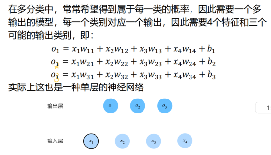

# 机器学习基本方法

资料来源：视听导课程 

1. 线性回归
   1. 线性回归 多项式回归
   2. 损失函数(均方损失)
   3. 正则化
2. 线性分类器
   1. 逻辑回归 
   2. softmax回归
   3. 支持向量机

## 1 线性回归

### 线性回归 多项式回归

#### 损失函数（均方损失）

注意这里是最朴素的线性空间欧式距离的思想；同时即使引入了非线性的噪声，由于高斯分布的表达式中也符合平方关系，在最大似然的处理方法中，这个均方误差也有很大的优势。

#### 正则化

* 用于量化我们对一个假设相对于另一个假设的偏好程度的函数

* 过拟合的多项式通常有很大的系数

* 正则化后的梯度下降

* 为什么使用𝐿2范数，而不是𝐿1范数?
  * 𝐿2正则化线性模型构成经典的**岭回归**（ridge regression）算法，𝐿1正则化线性回归是统计学中类似的基本模型，通常被称为**套索回归**（lasso regression）。
  * 使用𝐿2范数的一个原因是它对**较大的权重向量惩罚较大**。这使得我们的学习算法偏向于在大量特征上均匀分布权重的模型。在实践中，这可能使它们**对单个变量中的观测误差更为稳定**。
  * 相比之下，𝐿1惩罚会导致模型将权重**集中在一小部分特征**上，而将其他权重清除为零。这称为特征选择（feature selection），这可能是其他场景下需要的。

## 2 线性分类器

### 逻辑回归 softmax回归

问题思考：

* 0-1损失函数不连续，不好优化；线性回归的损失函数，拟合的直线如果不是二分类的分界线，高置信度反而会使得loss变高
  * 而Logistic函数预测的值在[0,1]区间，且可与前面的线性分类相结合
    * 但出现的问题：如果预测值极端，实际上我们应该大步的更新𝑤𝑗，但由于此时梯度接近零，难以做到（logistic函数在极限两端几乎是一条直线）
    * 故引入交叉熵损失函数：
      * 𝐿𝐶𝐸 (𝜎(𝑧) , 𝑦) =−𝑦 log 𝜎(𝑧) −(1-y)log (1-𝜎(z)) ,  𝑧 = 𝑊^𝑇*𝑋 \+b，𝜎 (𝑧) =1/(1+𝑒^−𝑧)

* 在多分类中，常常希望得到属于每一类的概率，因此需要一个多输出的模型，每一个类别对应一个输出（要将输出视为概率，要保证在任何数据上的输出都是非负的且总和为1；同时最好可导）；

  * 

    * 使得可以出现多输出

  * 引入Softmax函数（使得在多输出的结果上归一化出每一类的相对预测值）

    * 
    * 接下来使用每一类的预测值与标签之间的损失，累积计算整体的损失
    * 

    * 
    * 注意这里是推广到多维的交叉熵损失函数，看起来逻辑回归是两项，这里每一次是一项，但其实n=2时求和就是两项；多分类问题这里的损失函数设计采用的就是每一类的预测值和真实值相比较之后的损失之和。

逻辑回归和softmax回归虽然也是对输入特征线性处理了，但是核心在于后续的指数设计以及交叉熵的运用，把这种二值离散关系映射成了对数关系，本质还是进行了非线性的映射；而支持向量机的方法是最朴素的欧式距离的思想，核心思想是计算和拟合的分类界限之间的欧式距离作为需要优化的损失函数/或者说核心是找到一个超平面来分割。（实际上SVM可以通过加入核函数处理非线性问题，但是LDA线性判别方法只能用于处理线性可分的问题）

### 支持向量机

总结这两种分类器使用的损失函数：

